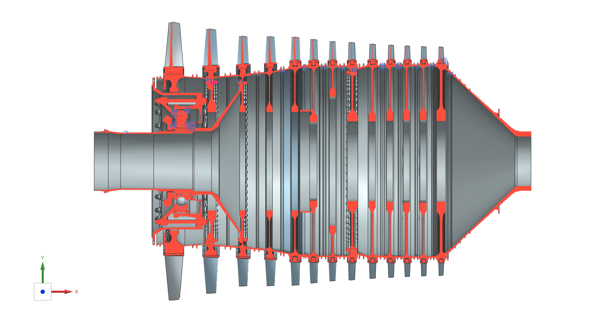

# This is a modeling project for modified aircraft engine based on PW4000

## Introduction

    Use NX UG 3D CAE software to model the rotor of high-pressure compressor of modified PW4000.

    I model all the components seperately.

    first of all, modify the origin drawing of PW4000, adding two level of compressor, because computing result of flow part requires.

    for each level of rotor, get the blade sections from Ansys BladeGen component. The component requries some information of blade, e.g. the inlet angle for three section, the lowest and middle and the highest. make base for blade so that it can be placed into notches of corresponding disk. diskes are mostly made of "rotation" and "hole" tool.

    for each other component, mostly of them are made of "rotation". They are easy one.

    The most time-costing procedure is the fitting of blade and disk. 

## Result Rendering Picture

